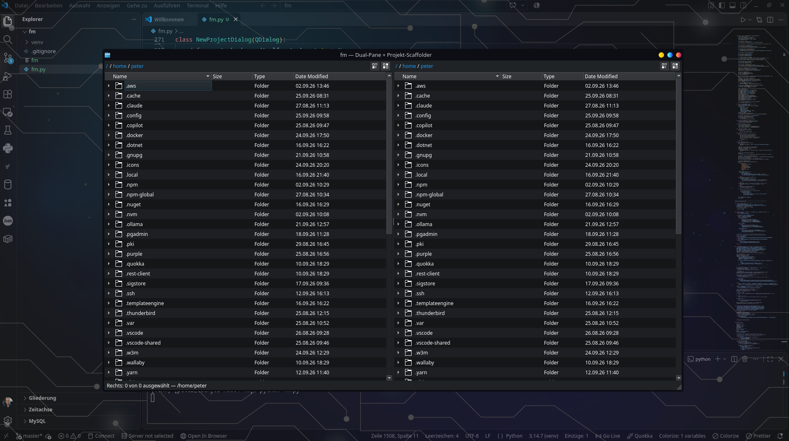
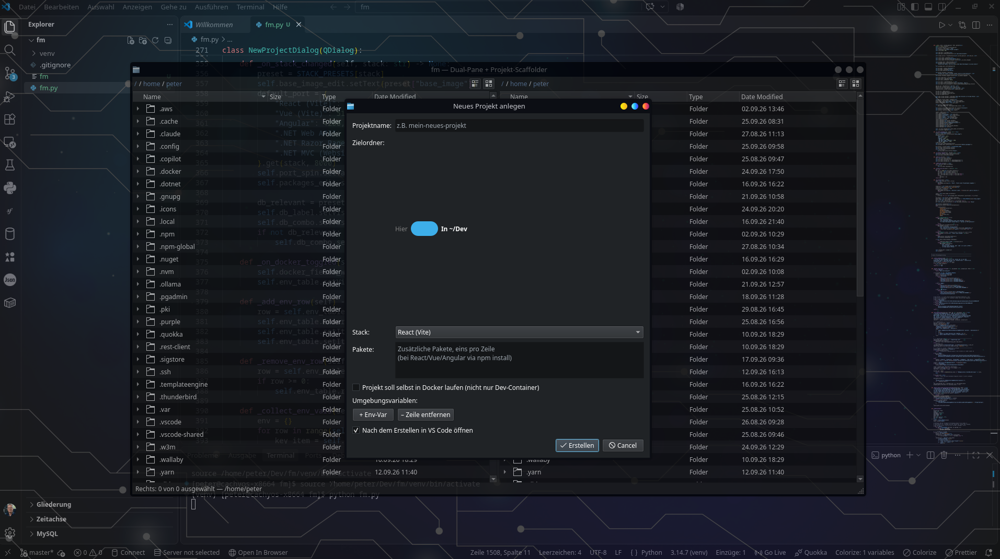
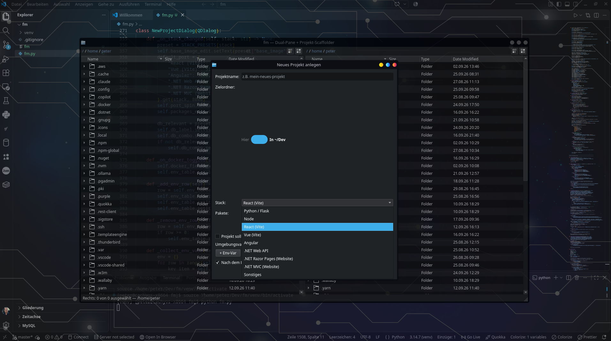

# fm

Ein Dual-Pane-Dateimanager für Linux (PySide6/Qt), mit eingebettetem Terminal,
Archiv-Unterstützung und einem Projekt-Generator für neue Entwicklungsprojekte.

## Screenshots







## Funktionen

**Dateiverwaltung**
- Zwei unabhängige Panes nebeneinander, mit Tabs pro Pane
- Listen- und Kachelansicht, Breadcrumb-Pfadleiste (Strg+L zum direkten Eingeben)
- Kopieren, Ausschneiden, Einfügen, Umbenennen, Löschen in den Papierkorb (freedesktop-konform)
- Drag & Drop zwischen Panes und in Unterordner, Strg beim Ziehen kopiert
- Neue Ordner, Vorschau (Bilder, PDF, Text, Office-Dateien) per F3
- Rechte & Eigentümer (chmod/chown) mit Oktal-Eingabe, optional rekursiv
- Passende Icons je Dateityp (Word, Excel, Python, JavaScript, Archive, …)
- Bildvorschau als Thumbnail direkt in der Ansicht

**Suche**
- Dateiname als Teiltext oder Glob (z. B. `*.py`)
- Optional Volltextsuche in Textdateien bis 5 MB
- Läuft im Hintergrund, abbrechbar

**Archive**
- Doppelklick auf ein Archiv öffnet die Inhaltsansicht
- Entpacken „hier“ oder „nach …“, einzelne Einträge oder alles
- Packen zu ZIP, TAR.GZ, TAR.BZ2 oder TAR.XZ
- Unterstützt: `.zip`, `.tar`, `.tar.gz`/`.tgz`, `.tar.bz2`/`.tbz2`, `.tar.xz`/`.txz`
  (7z und RAR werden nicht unterstützt)

**Terminal**
- Eingebettetes, echtes Terminal unten im Fenster (F4), Shell aus `$SHELL`
- Farben, Cursor-Steuerung und Vollbild-Programme wie `vim`, `htop`, `less` funktionieren
- Mausrad scrollt durch den Verlauf, Knopf „→ aktueller Ordner“ wechselt in den Ordner des aktiven Panes

**Lesezeichen**
- Einblendbare Leiste links (Strg+B), Klick navigiert das aktive Pane
- Strg+D merkt den aktuellen Ordner, Rechtsklick entfernt einen Eintrag
- Gespeichert in `~/.config/fm/bookmarks.json`

**Projekt-Generator (F7)**
- Erzeugt Grundgerüste für Python/Flask, Node, React (Vite), Vue (Vite), Angular,
  .NET Web API, .NET Razor Pages, .NET MVC sowie Datenbank-Container (PostgreSQL, MySQL, SQL Server)
- Frontend-Projekte werden über die offiziellen CLI-Generatoren erstellt

## Voraussetzungen

- Linux (getestet mit KDE Plasma unter Wayland)
- Python 3 (getestet mit 3.14)
- Optional, je nach Funktion:
  - **LibreOffice** (`soffice`) für die Vorschau von Office-Dateien
  - **Node.js + npm/npx** für die Node-, React-, Vue- und Angular-Vorlagen
  - **.NET SDK** für die .NET-Vorlagen

## Installation

```bash
git clone https://github.com/peter1965p/fm.git
cd fm
python3 -m venv venv
venv/bin/pip install -r requirements.txt
```

## Starten

```bash
./fm                 # öffnet im Home-Verzeichnis
./fm /pfad/zum/ordner
```

Alternativ direkt mit Python:

```bash
venv/bin/python3 fm.py [Startpfad]
```

> Hinweis: Das Startskript `fm` verweist fest auf `~/Dev/fm/venv`. Wenn du das Projekt
> an einen anderen Ort legst, passe den Pfad in dieser Datei an.

## Tastenkürzel

| Taste | Aktion |
|---|---|
| Tab | Aktives Pane wechseln |
| Strg+L | Pfad eingeben |
| Backspace | Eine Ebene nach oben |
| F3 | Vorschau |
| F2 | Umbenennen |
| F4 | Terminal ein-/ausblenden |
| F5 | Aktualisieren |
| F7 | Neues Projekt |
| Entf | In den Papierkorb |
| Strg+C / Strg+X / Strg+V | Kopieren / Ausschneiden / Einfügen |
| Strg+F | Suchen |
| Strg+T | Neuer Tab |
| Strg+W | Tab schließen |
| Strg+Tab / Strg+Umschalt+Tab | Nächster / vorheriger Tab |
| Strg+B | Lesezeichen-Leiste ein-/ausblenden |
| Strg+D | Aktuellen Ordner als Lesezeichen merken |
| Strg+Q | Beenden |

Im Terminal werden alle Tastenkürzel an die Shell weitergegeben, außer F4 (Terminal ausblenden).

## Projektstruktur

```
fm.py              Die gesamte Anwendung
fm                 Startskript
requirements.txt   Python-Abhängigkeiten (PySide6, pyte)
```

## Lizenz

GNU General Public License v3.0 oder neuer — siehe [LICENSE](LICENSE).
Du darfst fm frei nutzen, verändern und weitergeben, solange abgeleitete Versionen
unter derselben Lizenz bleiben.
